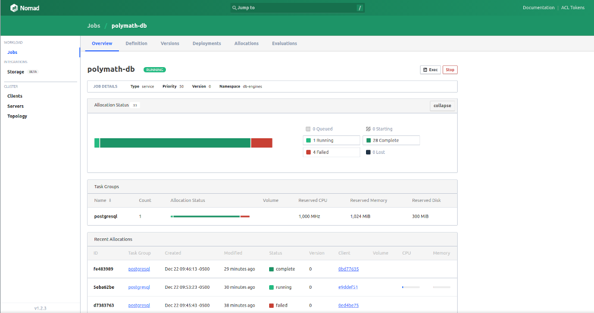
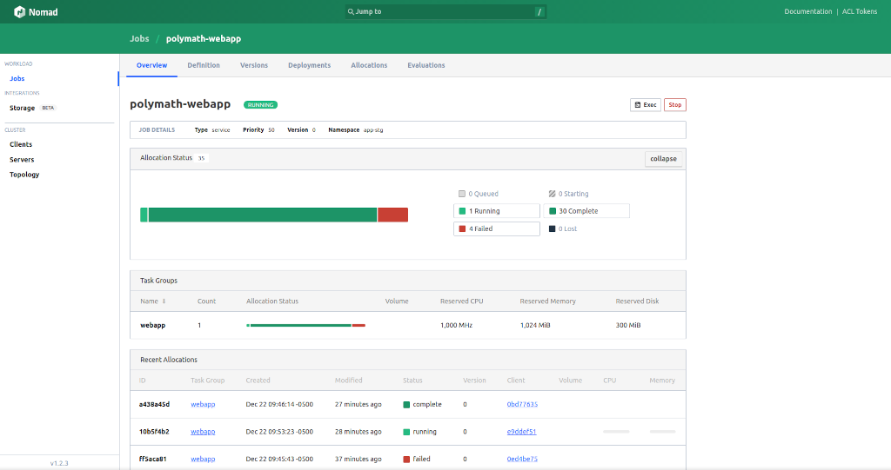

## AWS WEBAPP DEPLOYMENT - Using Hashicorp Nomad

This is a self contained folder structure of a PoC that includes WebApp project and all the dependencies to manage and deploy it into AWS Cloud Provider. It can also be bind mount on a local volume to create :-
1. Local Nomad node as a _DEV ENV_ 
2. AWS Staging Nomad node as a _STAGING ENV_ 

#### Tech Stack/Prerequisites And Assumptions

- A minimum of 1 Nomad node with Docker driver enabled
- Nomad has been set up to orchestrate containers via Docker/LXC Driver
- Main tools are Terraform And Ansible For IaC to provision and manage deployment of staging env + app
- Linux/Ubuntu Based Dev, Staging And Production Env
- Local PostgreSQL client running on the Nomad node

#### How To Run This WebApp Deployment PoC

- To start, clone the repo into a work env folder of choice
```bash
git clone git@github.com:gluzangi/polymath-web-app-iac.git

cd ./polymath-web-app-iac
```

1. Use `terraform-scripts/variables.tf` to setup your terraform tool and launch a staging env on AWS :
```bash
Outputs:                                                              
ec2_instance_public_ips = [
  "54.200.120.171",
]
vpc_public_subnets = [
  "subnet-0a97d02059fb891e2",
  "subnet-0bd0652dfa07a3b88",
]
```
_NOTE : make sure to setup your own terraform deployer-key_

2. Grab the ec2_instance_public_ips address(es) and create a node ansible inventory list by adding to file `ansible-playbooks/cluster.nodes` :
```bash
[nodes]
54.200.120.171
```

3. Run ansible playbooks to set Staging Env with Docker + Nomad + Other Deployment/Hosting related tooling:
```bash
#! /bin/bash
#
# To do a dry run use :
#
# ANSIBLE_HOST_KEY_CHECKING=False ansible-playbook -i cluster.nodes -C -K playbook.yml
#
ANSIBLE_HOST_KEY_CHECKING=False ansible-playbook -i cluster.nodes -K playbook.yml
```

4. Make sure Docker + Nomad Server(s) running as a systemctl controlled daemon on the deployed box(es):
```bash
sudo systemctl status docker

sudo systemctl status nomad
```

_NOTE : Docker Driver for Nomad Client interface might need tweaking especially dealing with Stateful Deployments through eg host-volumes_ 
```bash
ubuntu@54.200.120.171:~$ nomad node status -self
ID              = e9ddef51-69c4-b872-a7d7-011ee4bdd247
Name            = 54.200.120.171
Class           = <none>
DC              = dc1
Drain           = false
Eligibility     = eligible
Status          = ready
CSI Controllers = <none>
CSI Drivers     = <none>
Uptime          = 5h16m15s
Host Volumes    = vol-db-pgsql,vol-db-archive
Host Networks   = <none>
CSI Volumes     = <none>
Driver Status   = docker,lxc

Node Events
Time                  Subsystem  Message
2021-12-22T17:31:46Z  Cluster    Node heartbeat missed
2021-12-22T14:46:25Z  Cluster    Node reregistered by heartbeat
2021-12-22T14:45:42Z  Cluster    Node heartbeat missed
2021-12-22T14:13:45Z  Cluster    Node reregistered by heartbeat

Allocated Resources
CPU         Memory       Disk
0/4666 MHz  0 B/3.7 GiB  0 B/32 GiB

Allocation Resource Utilization
CPU         Memory
0/4666 MHz  0 B/3.7 GiB

Host Resource Utilization
CPU            Memory           Disk
4209/4666 MHz  1.3 GiB/3.7 GiB  15 GiB/49 GiB

Allocations
ID        Node ID   Task Group  Version  Desired  Status    Created    Modified
e15f7910  e9ddef51  webapp      0        run      pending   50s ago    3s ago
53282a6f  e9ddef51  postgresql  0        run      pending   50s ago    3s ago
5eba62be  e9ddef51  postgresql  0        stop     complete  2h40m ago  1s ago
10b5f4b2  e9ddef51  webapp      0        stop     complete  2h40m ago  2s ago
```


5. Get into the provisioned node(s) and run Nomad Scripts:
```bash
scp -r ./nomad-scripts ubuntu@54.200.120.171:~/

ssh ubuntu@54.200.120.171

cd ~/nomad-scripts
```

6. Deploy a set of microservices (The WebApp) by using Nomad in AWS staging env:

- POSTGRESQL DEPLOYMENT:
```bash
nomad plan db-pgsql.nomad

nomad job run -check-index 0 db-pgsql.nomad
```


- WEBAPP DEPLOYMENT:

```bash
nomad plan webapp.nomad

nomad job run -check-index 8774 webapp.nomad
```


7. Verify WebApp has been successfuly deployed:
```bash
http http://54.200.120.171:8080/

HTTP/1.1 400 Bad Request
Content-Length: 283
Content-Type: text/plain; charset=utf-8
Date: Wed, 22 Dec 2021 15:27:48 GMT

Unable to update the counterUnable to read the counter value<!DOCTYPE html><html><head><title>Thanks for your visit!</title></head><body><b>IP addresses:</b><p><b>Type:</b> ip from remote addr, <b>value:</b> 135.23.225.150<br></p><p><b>Number of visits so far:</b> 0</p></body></html>
```

#### TODO / RANDOM / UNFINISHED IDEAS :
- Build CI/CD automation around the workflow of the deployment process
- Use immutable Nomad EC2 images on autoscaling group for horizontal scaling
- Injecting customizable ENV_VAR through .env file
- Using Vault for Secret Management
- Use Consul for PostgreSQL DB Service Discovery
- Why & When To Use Terraform AWS Module For Nomad?


### References

 - [Nomad Docker Driver](https://www.nomadproject.io/docs/drivers/docker) - Config Nomad Docker Driver
 - [Nomad AWS Module](https://github.com/hashicorp/terraform-aws-nomad) - AWS Module For Nomad
 - [Consul AWS Module](https://github.com/hashicorp/terraform-aws-consul) - AWS Module For Consul
 - [AWS Terraform Module ](https://registry.terraform.io/namespaces/terraform-aws-modules) - AWS Terraform Module
 - [Terraform Module For How To Run Nomad On AWS](https://registry.terraform.io/modules/hashicorp/nomad/aws/latest) - Terraform AWS Module For Nomad

### Tech Stack List

 1. [Nomad](https://www.nomadproject.io/docs) - Nomad Docs
 2. [Consul](https://www.consul.io/docs) - Consul Docs
 3. [Vault](https://www.vaultproject.io/docs) - Vault Docs
 4. [Packer](https://www.packer.io/docs) - Packer Docs
 5. [Terraform](https://www.terraform.io/docs) - Terraform Docs
 6. [Terragrunt](https://terragrunt.gruntwork.io/docs/) - Terragrunt Docs
 7. [Ansible](https://docs.ansible.com/ansible_community.html) - Ansible Docs
 8. [Docker](https://docs.docker.com/) - Docker Docs
 9. [PostgreSQL Documentation](https://www.postgresql.org/docs/14/index.html) - PGSQL 14 Documentation


> **NOTE:** Library dependencies for the WebApp and Infrastructure requirements must be resolved during the setup process.

### Author/Developer

-  [Gerald Luzangi](https://github.com/gluzangi/)
